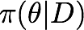

PyLearn
=======

PyLearn is a resource for Bayesian inference and machine learning in Python. 

### Introduction

How do we infer and learn from experience ?   

Edwin Jaynes, in his influential [How does the brain do plausible reasoning ?](http://bayes.wustl.edu/etj/articles/brain.pdf), wrote

> One of the most familiar facts of our experience is this: that there *is* such a thing as common sense, which enables us to do plausible reasoning in a fairly consistent
way. People who have the same background of experience and the same amount
of information about a proposition come to pretty much the same conclusions as to
its plausibility. No jury has ever reached a verdict on the basis of pure deductive
reasoning. Therefore the human brain must contain some fairly definite mechanism
for plausible reasoning, undoubtedly much more complex than that required for
deductive reasoning. But in order for this to be possible, *there must exist consistent
rules for carrying out plausible reasoning, in terms of operations so definite that
they can be programmed on the computing machine which is the human brain*.

Jaynes went on to show that these "consistent rules" are just the rules of Bayesian probability theory, supplemented by Laplace's principle of indifference and, its generalization, Shannon's principle of maximum entropy. This key observation implies that a computer can be programmed to "reason", or, update probabilities based on data. Given some very minimal desiderata, the rules of Bayesian probability are the only ones which conform to what, intuitively, we recognize as *rationality*. Such probability update rules can be used recursively to impute causal relationships between observations, that is, a machine can be programmed to "learn". 

**Inference and machine learning, then, is the creative application of Bayesian probability to problems of rational inference and causal knowledge discovery based on data.** 

I wrote a [short article in The Hindu](http://www.thehindu.com/sci-tech/science/article2747042.ece) about learning from experience, together with my colleague at [The Institute of Mathematical Sciences](https://www.imsc.res.in),  [Rahul Siddharthan](https://www.imsc.res.in/~rsidd). We jointly organized the [Bayes by the Bay](http://imsc50.imsc.res.in/article/bayes) where distinguished international colleagues lectured on applications of Bayesian inference to physics, biology, earth sciene, brain function and more. These [lectures are available on YouTube](https://www.youtube.com/playlist?list=PLhkiT_RYTEU2dnkJVZ8Tvr9QQx6xVuL30).

Here, I list [reading material](https://github.com/ronojoy/pylearn#reading-list), [algorithms and software](https://github.com/ronojoy/pylearn#algorithms-and-software), and [tutorial slides](https://github.com/ronojoy/pylearn/tree/master/presentations) with [example codes](https://github.com/ronojoy/pylearn/tree/master/scripts) from the ongoing [workshop series](https://www.youtube.com/playlist?list=PLhkiT_RYTEU1mkJHBUiA2Ze56h6z1uZgj) co-organized with [Dorai Thodla](https://github.com/dorait). 

I welcome contributions - clone this repository and send me a pull request!

## Inference and machine learning quotes

- "The goal of a Bayesian artificial intelligence is to produce a thinking agent which does as well or better than humans in such tasks, which can adapt to stochastic and changing environments, recognize its own limited knowledge and cope sensibly with these varied sources of uncertainty." - [Korb](http://www.csse.monash.edu.au/~korb/) and [Nicholson](http://www.csse.monash.edu.au/~annn/)

- "Graphical models are a marriage between probability theory and graph theory. They provide a natural tool for dealing with two problems that occur throughout applied mathematics and engineering -- uncertainty and complexity -- and in particular they are playing an increasingly important role in the design and analysis of machine learning algorithms. Fundamental to the idea of a graphical model is the notion of modularity -- a complex system is built by combining simpler parts. Probability theory provides the glue whereby the parts are combined, ensuring that the system as a whole is consistent, and providing ways to interface models to data. The graph theoretic side of graphical models provides both an intuitively appealing interface by which humans can model highly-interacting sets of variables as well as a data structure that lends itself naturally to the design of efficient general-purpose algorithms." - [Michael Jordan](https://www.eecs.berkeley.edu/Faculty/Homepages/jordan.html)

- "Many of the classical multivariate probabalistic systems studied in fields such as statistics, systems engineering, information theory, pattern recognition and statistical mechanics are special cases of the general graphical model formalism -- examples include mixture models, factor analysis, hidden Markov models, Kalman filters and Ising models. The graphical model framework provides a way to view all of these systems as instances of a common underlying formalism. This view has many advantages -- in particular, specialized techniques that have been developed in one field can be transferred between research communities and exploited more widely. Moreover, the graphical model formalism provides a natural framework for the design of new systems." - [Michael Jordan](https://www.eecs.berkeley.edu/Faculty/Homepages/jordan.html)

- "... how do we take core inferential ideas and turn them into engineering systems that can work under whatever requirements that one has in mind (time, accuracy, cost, etc), that reflect assumptions that are appropriate for the domain, that are clear on what inferences and what decisions are to be made (does one want causes, predictions, variable selection, model selection, ranking, A/B tests, etc, etc), can allow interactions with humans (input of expert knowledge, visualization, personalization, privacy, ethical issues, etc, etc), that scale, that are easy to use and are robust. Indeed, with all due respect to bridge builders (and rocket builders, etc), but I think that we have a domain here that is more complex than any ever confronted in human society." - [Michael Jordan](https://www.eecs.berkeley.edu/Faculty/Homepages/jordan.html)

- "A computer program is said to learn from experience E with respect to some class of tasks T and performance measure P, if its performance at tasks in T, as measured by P, improves with experience E" - [Tom Mitchell](https://www.cs.cmu.edu/~tom/)

- "...from now on we can compare our data with the model we actually want to use rather than with a model which has some mathematical convenient form. This is surely a revolution." - [Peter Clifford](http://www.stats.ox.ac.uk/~clifford/) on **Metropolis sampling**.

## Online courses

- [Probabilistic graphical models](https://www.coursera.org/course/pgm) - by Daphne Koller on Coursera

## Slide decks

- [Probabilistic programming : what, why, how, when ?](http://www.slideshare.net/salesforceeng/probabalistic-programming-why-what-how-when) by Beau Cronin. 

## Reading list

This is my reading list for Bayesian probability and its application to machine learning problems. The sections covered in this list are:

- [Classics of Bayesian probability](https://github.com/ronojoy/pylearn#classics-of-bayesian-probability)
- [Bayesian inference in statistical analysis](https://github.com/ronojoy/pylearn#bayesian-inference-in-statistical-analysis)
- [Bayesian networks](https://github.com/ronojoy/pylearn#bayesian-networks)
- [Bayesian decision theory](https://github.com/ronojoy/pylearn#bayesian-decision-theory)
- [Bayesian risk analysis](https://github.com/ronojoy/pylearn#bayesian-risk-analysis)

### Classics of Bayesian probability
- Philosophical Essay on Probabilities - Pierre-Simon Laplace
- A Treatise on Probability - John Maynard Keynes
- Probability Theory - Harold Jeffreys
- Probability Theory : the logic of science - Edwin Jaynes

### Bayesian inference in statistical analysis
- Bayesian statistics - P. M. Lee
- Bayesian inference in statistical analysis - Box and Tiao
- Data analysis : a Bayesian tutorial - Devinder Sivia
- Bayesian data analysis - Gelman, Karlin, Stern and Rubin  

### Bayesian networks
- Probabilistic Reasoning in Intelligent Systems - Judea Pearl
- Probabilistic Reasoning in Expert Systems : theory and algorithms - R. E. Neapolitan
- Bayesian Artificial Intelligence - Korb and Nicholson
- Probabilistic Graphical Models - Koller and Friedman
- Inovations in Bayesian Networks - Holmes and Jain 

The last reference includes the classic **Tutorial on Learning with Bayesian Networks** by David Heckerman.

### Bayesian decision theory
- Statistical decision theory - J. O. Berger
- The Bayesian choice: From decision-theoretic foundations to computational implementation - C. P. Robert

### Bayesian risk analysis
- [Wash-1400](https://en.wikipedia.org/wiki/WASH-1400): The Reactor Safety Study - N. Rasmussen et al.
- [On the quantitative definition of risk](http://onlinelibrary.wiley.com/doi/10.1111/j.1539-6924.1981.tb01350.x/abstract;jsessionid=825CCFCF2B25EA36D722BB7B6E8EF3CB.f01t02) -  Garrick and Kaplan
- Probabilistic risk analysis - Bedford and Cooke

### Antecedents
- The Science of Proof - J. H. Wigmore
- [Correlation and Causation](http://www.ssc.wisc.edu/soc/class/soc952/Wright/Wright_Correlation%20and%20Causation.pdf) - Sewall Wright
- The Analysis of Evidence: How to Do Things with Facts Based on Wigmore's Science of Judicial Proof - Anderson and Twining
- [Using a graphical method to assist the evaluation of complicated patterns of evidence](http://www.ncjrs.gov/App/abstractdb/AbstractDBDetails.aspx?id=168682) - Dawid and Evett

## Algorithms and software

Since this is a resource for machine learning in Python, this basic toolchain is *sine qua non*!
- [Numpy](www.numpy.scipy.org) - N-dimensional arrays for Python
- [Scipy](www.scipy.org) - basic numerical algorithms, built on top of Numpy
- [Pandas](www.pandas.pydata.org) - data structures and tools for data analysis
- [Matplotlib](matplotlib.org) - 2d plotting library
- [Ipython](ipython.org) - an enhanced Python shell and notebook interface

The most popular machine learning library in Python is scikits-learn but few of its algorithms are explicitly probablistic. Probablistic graphical models (PGMs) are implemented in three good Python libraries listed below. 

- [scikit-learn](http://scikit-learn.sourceforge.net/) - regression, clustering, classification and more.
- [libpgm](http://pythonhosted.org/libpgm/) - representation, inference and learning of PGMs.
- [pgmpy](https://github.com/pgmpy) - same as above but has a NetworkX interface to visualize PGMs.
- [pomegranate](https://github.com/jmschrei/pomegranate) - PGM module with nice syntax and Cython for speed.
- [Lea](https://code.google.com/p/lea/) - probability distributions with encapsulated probabilistic programming language. 
- [Daft](https://github.com/dfm/daft) - rendering of probabilistic graphical models.
- [MIT Probabilistic Computing Project](http://probcomp.csail.mit.edu/) - Venture, BayesDB, Picture and CrossCat. 
- [UnBBayes](http://sourceforge.net/projects/unbbayes/) - the only non-Python code to make the list. Has Bayesian networks, probabilistic ontologies, and more!

Python has a several good IDEs. Two of my favourites are
- [Spyder](spyderlib.org) - inspired by the Matlab IDE
- [Rodeo](https://github.com/yhat/rodeo) - a data-centric IDE for Python

